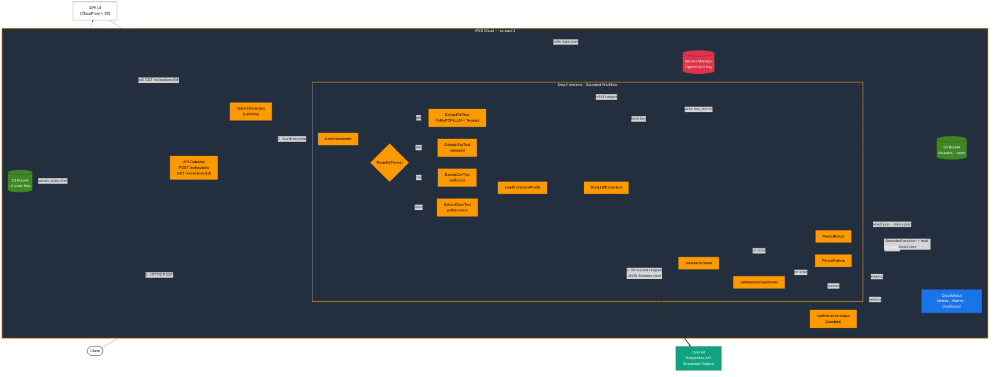

# Universal Extractor

**Production-grade document extraction pipeline that turns any PDF, XLSX, CSV, or DOCX into validated, schema-bound JSON — powered by OpenAI Structured Outputs on AWS serverless.**

Unstructured business documents (payslips, invoices, statements, forms) are the last mile of data engineering. Universal Extractor solves that last mile with a format-agnostic pipeline where a single versioned "extraction profile" (prompt + JSON Schema) deterministically governs what the LLM returns — no free-form parsing, no regex cleanup, no drift between runs.

The project is a reference implementation of the AI-Engineer playbook: LLMs as constrained function callers, strict schemas as contracts, domain-aware business rule validation, ground-truth fixtures as offline benchmarks, online CloudWatch monitoring, and a cost-aware, auditable cloud architecture around the model call.

---

## Engineering highlights

**LLM reliability engineering**
- **OpenAI Responses API + Structured Outputs (`strict=true`).** The JSON Schema is passed directly to the model as a hard constraint. No retries on malformed JSON, no post-hoc repair, no hallucinated fields.
- **Versioned prompt/schema pairs.** Every profile is `profiles/<id>/<version>.yml`. Changes ship as a new version — old executions stay reproducible.
- **Domain-aware prompting.** The payroll profile ships a taxonomy (earnings vs. deductions), number/date normalization rules (US `1,234.56` → `1234.56`, `MM/DD/YYYY` → `YYYY-MM-DD`), and nullability discipline (never invent values).
- **Measurable accuracy.** Every fixture ships with a `.expected.json` ground-truth file. Current field-level accuracy on the payroll profile: **PDF 98.6% · XLSX 95.7% · CSV 100% · DOCX 98.6%**.
- **Production controls around the model call.** LLM runs include prompt-injection boundaries, retryable/non-retryable error taxonomy, optional chunking for long documents, confidence scoring, token/cost metrics, trace artifacts, and DynamoDB cache deduplication.
- **Domain-level business rule validation.** A dedicated `ValidateBusinessRules` Lambda (inserted after JSON Schema validation) enforces 7 payroll invariants — numeric sanity, math consistency, and required-field presence — that schema validation cannot express. Violations are recorded in the result, not fatal, so every run is fully auditable.
- **Online monitoring.** CloudWatch custom metrics (`UniversalExtractor` namespace) track extraction success/failure rates, LLM confidence, business rules pass rate, cost per run, and pay value distributions. Three SNS-backed alarms alert on failure spikes, confidence drops, and sustained rule violations. A 4-panel dashboard is provisioned by the SAM template.

**Format-agnostic ingestion**
- One `payroll/v1` schema, four extraction paths (multi-strategy PDF, openpyxl, stdlib `csv`, python-docx), one consistent result shape. Adding a new format is one Lambda + one branch in the Step Functions `Choice` state — no schema change.
- PDFs are classified before extraction and routed through text-layer Markdown first, then AWS Textract OCR/table extraction for scanned or sparse documents, with an optional OpenAI Vision fallback.

**Cloud-native architecture**
- Async-by-default via **Step Functions Standard Workflow** (no long-running HTTP, no client polling assumptions). `GET /extractions/{request_id}` closes the async loop — the endpoint reconstructs the execution ARN from `request_id`, calls `DescribeExecution`, and returns the richer S3 payload once done.
- Every task catches `States.ALL` and routes to `PersistFailure` — failed runs produce an auditable `error.json`, not silent drops.
- **Per-run S3 artifact tree** under `runs/<profile>/<version>/<YYYY>/<MM>/<DD>/<request_id>/`: input, metadata, raw text, raw LLM response, validated result, business rules report, status. Debuggable post-hoc without log diving.
- **Secrets Manager** for the OpenAI key — never in code, never in env files at rest.
- **Infrastructure as Code** via AWS SAM; **CI/CD** via a Jenkins pipeline with preflight, validate, build, deploy, fixture-sync, and UI-deploy stages.
- **Static SPA** (`ui/index.html`) hosted on S3 + CloudFront. CloudFront routes `/extractions*` to API Gateway (with origin path `/{stage}`) and the default behavior to S3 — the UI uses relative URLs and requires no build step.

---

## Architecture



### Request flow

1. **Submit** — Client POSTs a document reference (`{bucket, key}`) plus a profile ID+version to API Gateway. `SubmitExtraction` assigns a `request_id`, derives the S3 output prefix, persists `input.json`, and starts a Step Functions execution. Returns `202 Accepted` with `execution_arn`.
2. **Fetch & route** — `FetchDocument` does an S3 `HEAD`, detects format from extension + `Content-Type`, and persists `document_metadata.json`. `RouteByFormat` branches on `document_format`.
3. **Extract text** — The format-specific Lambda pulls bytes from S3 and normalizes to a single `raw_text.txt`. PDFs are classified and extracted with text-layer Markdown, Textract OCR/table extraction, or optional Vision fallback. XLSX/CSV/DOCX use a pipe-delimited table convention so tabular data looks uniform to the LLM.
4. **Load profile** — `LoadExtractionProfile` reads `profiles/<id>/<version>.yml`, enforcing structural contracts (object schema, `additionalProperties: false`, required keys, prompt templates).
5. **Extract with LLM** — `RunLLMExtraction` calls the OpenAI Responses API with `text.format = json_schema`, `strict=true`, and the exact schema from the profile. The Mustache-style user template (`{{document_text}}`, `{{metadata_json}}`, …) is rendered per request.
6. **Validate schema** — Second-line defense: `jsonschema.Draft202012Validator` re-validates the response (Structured Outputs is strict, but we don't trust the wire).
7. **Validate business rules** — `ValidateBusinessRules` checks 7 payroll domain invariants that the JSON Schema cannot express: numeric sanity (`gross > net`, both positive), math consistency (`|gross - deductions - net| / gross < 2%`), and required-field presence. Violations are recorded, not fatal — the pipeline always reaches `PersistResult`.
8. **Persist** — `PersistResult` (or `PersistFailure` via a `States.ALL` catch) writes `result.json` / `status.json` / `error.json` under the run prefix and emits CloudWatch metrics.
9. **Poll for result** — `GET /extractions/{request_id}` reconstructs the execution ARN, calls `DescribeExecution`, and returns the S3 payload. Returns `202` while running, `200` on any terminal state.

---

## Quickstart

### Call the deployed API

```bash
curl -X POST "https://<api-id>.execute-api.<region>.amazonaws.com/<stage>/extractions" \
  -H "Content-Type: application/json" \
  -d '{
    "document": {
      "bucket": "payroll-dev-<account>-sa-east-1",
      "key": "datasets/fixtures/payroll/pdf/paystub_001_canonical.pdf"
    },
    "extraction_profile": {"id": "payroll", "version": "v1"},
    "client_id": "demo",
    "document_id": "paystub_001",
    "idempotency_key": "demo-paystub-001-payroll-v1"
  }'
```

Response:

```json
{
  "status": "accepted",
  "request_id": "req_5b51cc1e029b4c3bbd63538e",
  "execution_arn": "arn:aws:states:sa-east-1:...:execution:document-extraction:req_...",
  "output_prefix": "s3://payroll-dev-.../runs/payroll/v1/2026/04/19/req_..."
}
```

Poll for the result (returns `202` while running, `200` when done):

```bash
curl "https://<api-id>.execute-api.<region>.amazonaws.com/<stage>/extractions/req_5b51cc1e029b4c3bbd63538e"
```

Or fetch the S3 artifact directly once the execution succeeds:

```bash
aws s3 cp s3://<bucket>/runs/payroll/v1/2026/04/19/<request_id>/result.json -
```

### Use the web UI

After deploy, the `UiUrl` CloudFormation output gives the CloudFront HTTPS URL. Open it in a browser, fill in the document bucket/key and profile, and submit — the UI polls automatically and renders the extraction result with confidence score and business rules report.

### Run an extraction locally

No AWS credentials needed — only an OpenAI API key in `.env`:

```bash
./.venv/bin/python scripts/extract_locally.py \
  --pdf tests/fixtures/payroll/pdf/paystub_001_canonical.pdf \
  --profile payroll --version v1
```

Prints the extracted JSON, schema errors (if any), token usage, and model ID. Same profile loader and same OpenAI client code path as the Lambdas.

### Batch smoke test across formats

```bash
./.venv/bin/python scripts/smoke_test_formats.py
```

Runs CSV and DOCX extraction end-to-end against local fixtures and reports field-level accuracy vs. the ground-truth `.expected.json` files.

### Run the CI evaluation harness locally

```bash
./.venv/bin/python scripts/evaluate_fixtures.py --mode offline
```

Offline mode validates fixture schemas and text normalization without calling OpenAI. If `OPENAI_API_KEY` is configured, run the model-backed gate:

```bash
./.venv/bin/python scripts/evaluate_fixtures.py --mode llm --sample-per-format 1 --min-accuracy 0.95
```

---

## Extraction profiles

A profile is a single YAML file that fully specifies the extraction contract.

```yaml
# profiles/payroll/v1.yml
id: payroll
version: v1

prompt:
  system: |
    You are a structured document extraction assistant specialized in US payroll documents.
    Number formatting: US numbers use "," thousand separator. Strip currency symbols.
    Date formatting: Always return ISO YYYY-MM-DD.
    Nullability: If a field is not present, return null. Never invent values.
    Line-item classification:
      - "earning": Regular Pay, Overtime, Bonus, Commission, ...
      - "deduction": FIT, FICA-SS, FICA-MED, SIT, 401(k), Health, ...
  user_template: |
    Client ID: {{client_id}}
    Document ID: {{document_id}}
    Metadata: {{metadata_json}}
    Document text:
    {{document_text}}

schema:
  type: object
  additionalProperties: false
  required: [employer, employee, pay_period, currency, totals, line_items]
  properties:
    employer: { ... }
    # ...

validation:
  strict_schema: true
  required_non_empty_fields:
    - employer.name
    - employee.name
```

**Adding a new document type** = add a new profile directory. No code change required.

**Why this shape matters** (AI-Engineer perspective):
- Prompt, schema, and validation live in the *same* versioned artifact — drift between prompt and schema is structurally impossible.
- Strict-mode JSON Schema means every property is `required`; optional fields are modeled as `["<type>", "null"]` unions. This is the OpenAI Structured Outputs contract, not a stylistic choice.
- Rich field descriptions double as prompt context — the model reads the schema during generation and uses each field's `description` to disambiguate.

---

## Project layout

```
template.yml                    # SAM template: API Gateway, Step Functions, Lambdas, S3, IAM
Makefile                        # BuildMethod: makefile — copies functions/ + profiles/ + runtime-deps/
Jenkinsfile                     # Preflight → Build → Validate → Deploy → Sync fixtures

layers/common/python/app_common/
  config.py                     # Settings, Secrets Manager loader
  metrics.py                    # CloudWatch fire-and-forget metrics (Stage+Format+Profile dims + Stage agg)
  openai_client.py              # Responses API wrapper with Structured Outputs
  profiles.py                   # Profile loader + schema contract enforcement
  s3_utils.py                   # S3 helpers, output prefix derivation
  validators.py                 # Schema validation + business invariants

functions/
  submit_extraction/            # POST /extractions — start Step Functions execution
  get_extraction_status/        # GET /extractions/{request_id} — poll execution status
  fetch_document/               # S3 HEAD + format detection
  extract_{pdf,xlsx,csv,docx}_text/   # Format-specific extraction; PDF is multi-strategy
  load_extraction_profile/      # Load versioned profile YAML
  run_llm_extraction/           # OpenAI call with Structured Outputs
  validate_schema/              # Second-line JSON Schema validation
  validate_business_rules/      # 7 payroll domain invariants (numeric sanity, math, required fields)
  persist_{result,failure}/     # S3 persistence + CloudWatch metrics

ui/
  index.html                    # SPA: submit form, 2.5 s polling, result renderer (served via CloudFront)

profiles/
  payroll/v1.yml                # US payroll / pay stub profile
  cash_requirements/v1.yml      # (alternate domain profile)

tests/fixtures/payroll/
  {pdf,xlsx,csv,docx}/          # Synthetic fixtures + <stem>.expected.json ground truth

scripts/
  generate_fake_{pdf,xlsx,csv,docx}_payrolls.py  # Faker-driven synthetic data
  _paystub_data.py                               # Shared data model
  extract_locally.py                             # Run the full pipeline on a local PDF
  smoke_test_formats.py                          # Batch accuracy check across formats

events/
  submit-*.json                 # Sample API payloads
```

---

## Local development

```bash
# 1. Python env (mirrors the Jenkins Prepare Python stage)
python3.13 -m venv .venv
./.venv/bin/pip install -r requirements.txt awscli aws-sam-cli

# 2. Local env — put OPENAI_API_KEY in .env (loaded by app_common.config at import time)
echo "OPENAI_API_KEY=sk-..." > .env
echo "OPENAI_MODEL=gpt-4.1-mini" >> .env

# 3. Run a local extraction
./.venv/bin/python scripts/extract_locally.py \
  --pdf tests/fixtures/payroll/pdf/paystub_001_canonical.pdf \
  --profile payroll --version v1

# 4. Generate fresh synthetic fixtures (optional)
./.venv/bin/python scripts/generate_fake_payrolls.py      --out tests/fixtures/payroll/pdf  --count 5
./.venv/bin/python scripts/generate_fake_xlsx_payrolls.py --out tests/fixtures/payroll/xlsx --count 5
./.venv/bin/python scripts/generate_fake_csv_payrolls.py  --out tests/fixtures/payroll/csv  --count 5
./.venv/bin/python scripts/generate_fake_docx_payrolls.py --out tests/fixtures/payroll/docx --count 5
```

---

## Deployment

### SAM (manual)

```bash
# Runtime deps must be prebuilt into .aws-sam/runtime-deps — the Makefile does NOT pip-install.
rm -rf .aws-sam/runtime-deps && mkdir -p .aws-sam/runtime-deps
./.venv/bin/pip install -r requirements.txt -t .aws-sam/runtime-deps --upgrade --no-compile

./.venv/bin/sam validate --template-file template.yml --region sa-east-1
./.venv/bin/sam build --template-file template.yml
./.venv/bin/sam deploy --guided   # first time; subsequent runs reuse samconfig.toml
```

Relevant parameters:

| Parameter | Required | Default | Purpose |
|---|---|---|---|
| `StageName` | yes | `dev` | API Gateway stage + naming suffix |
| `OpenAIApiKeySecretArn` | yes | — | Secrets Manager ARN (must match `arn:aws:secretsmanager:*`) |
| `OpenAIModel` | yes | `gpt-4.1-mini` | OpenAI model ID |
| `DocumentsBucketName` | no | `payroll-<stage>-<account>-<region>` | Override the default bucket name |

### Jenkins (CI/CD)

The `Jenkinsfile` runs: `Checkout → Preflight → Prepare Python → Resolve AWS Identity → sam validate → sam build → Deploy → Sync Payroll Fixtures → Deploy UI`. The fixture-sync stage uploads `tests/fixtures/payroll/{pdf,xlsx,csv,docx}` to `datasets/fixtures/payroll/` in the deployed bucket. The Deploy UI stage reads the `UiBucketName` CloudFormation output and uploads `ui/index.html` with the correct `Content-Type`.

After a successful deploy, three CloudFormation outputs are particularly useful:

| Output | Purpose |
|--------|---------|
| `UiUrl` | CloudFront HTTPS URL for the extraction SPA |
| `ExtractionDashboardUrl` | Direct link to the CloudWatch 4-panel dashboard |
| `ExtractionAlertsTopicArn` | SNS topic ARN — subscribe an email in the console to receive alarm notifications |

---

## API contract

### Request

```json
{
  "document": { "bucket": "<s3-bucket>", "key": "<s3-key>" },
  "extraction_profile": { "id": "payroll", "version": "v1" },
  "client_id": "internal",
  "document_id": "paystub_001",
  "idempotency_key": "internal-paystub-001-payroll-v1",
  "metadata": { "source_system": "jenkins_fixture" }
}
```

### Response (202 Accepted)

```json
{
  "status": "accepted",
  "request_id": "req_<id>",
  "execution_arn": "arn:aws:states:...:execution:document-extraction:req_<id>",
  "output_prefix": "s3://<bucket>/runs/payroll/v1/YYYY/MM/DD/req_<id>"
}
```

### GET /extractions/{request_id}

Poll this endpoint until the status is no longer `RUNNING`.

| HTTP status | Meaning |
|-------------|---------|
| `202` | Execution still running |
| `200` | Terminal state — `status` field is `SUCCEEDED` or `FAILED` |
| `404` | Execution not found |

`200 SUCCEEDED` response body is the full `status.json` from S3 (includes `result_uri`, `extracted_data` summary, `business_rules`, `llm` metadata). `200 FAILED` returns `error.json` when available.

### Run artifacts (S3)

```
runs/payroll/v1/2026/04/19/req_<id>/
├── input.json                # The original submission payload
├── document_metadata.json    # S3 HEAD metadata + detected format
├── raw_text.txt              # Normalized text extracted from the document
├── llm_response.json         # Raw OpenAI response (model, usage, response_id)
├── usage_metrics.json        # Normalized tokens, cache hit, estimated marginal cost
├── llm_trace.json            # LLM-native run trace: prompt safety, cache, model call spans
├── result.json               # Validated, schema-conforming extraction
└── status.json               # Final execution status + timing
# error.json is written instead of result.json on failure
```

---

## Configuration

| Variable | Scope | Purpose |
|---|---|---|
| `DOCUMENTS_BUCKET_NAME` | Lambda | S3 bucket for source documents + run artifacts |
| `OPENAI_API_KEY_SECRET_ARN` | Lambda | Secrets Manager ARN — the key is fetched at cold start |
| `OPENAI_API_KEY` | Local only | Set in `.env` for local dev; bypasses Secrets Manager |
| `OPENAI_MODEL` | Lambda + local | OpenAI model ID (e.g. `gpt-4.1-mini`) |
| `OPENAI_BASE_URL` | Optional | Override for Azure OpenAI or proxies |
| `ENABLE_TEXTRACT` | Lambda (PDF) | Enables Textract fallback/OCR for scanned or sparse PDFs |
| `TEXTRACT_REGION` | Lambda (PDF) | Region used for Textract sync APIs; default deploy sets `us-east-1` |
| `ENABLE_VISION_FALLBACK` | Lambda (PDF) | Enables OpenAI Vision page transcription after Textract/text-layer failure |
| `OPENAI_VISION_MODEL` | Lambda (PDF) | Vision model for PDF fallback (default deploy sets `gpt-4o`) |
| `EXTRACTION_CACHE_TABLE` | Lambda (LLM) | DynamoDB cache table for same document/profile/model responses |
| `ENABLE_LLM_CACHE` | Lambda (LLM) | Enables DynamoDB response cache |
| `LLM_CACHE_TTL_DAYS` | Lambda (LLM) | Cache item TTL in days |
| `ENABLE_LLM_CHUNKING` | Lambda (LLM) | Enables bounded map/merge extraction for large normalized text |
| `MAX_SINGLE_PROMPT_CHARS` | Lambda (LLM) | Maximum document text size for a single model call |
| `LLM_CHUNK_CHARS` | Lambda (LLM) | Maximum text size per chunk when chunking is enabled |
| `MAX_LLM_CHUNKS` | Lambda (LLM) | Safety cap to prevent unbounded model cost |
| `ENABLE_CONFIDENCE_GATE` | Lambda (ValidateSchema) | Fails low-confidence outputs when enabled |
| `STATE_MACHINE_ARN` | Lambda (SubmitExtraction) | Target of `StartExecution` |
| `PROFILES_ROOT` | Optional | Override the profiles directory for testing |
| `STAGE_NAME` | Optional | Informational; set by the SAM template |

---

## Roadmap

- **Async Textract for very large PDFs.** Current OCR uses synchronous Textract per rendered page for predictable Lambda execution. Long, high-volume documents should move to `StartDocumentAnalysis` with SNS/EventBridge orchestration.
- **More profiles.** `invoice/v1`, `bank_statement/v1`, `purchase_order/v1` using the same profile shape.
- **Automated evaluation in CI.** Wire `smoke_test_formats.py` into Jenkins so profile/prompt changes can't regress accuracy silently.
- **Per-client profiles.** Namespace `profiles/<client_id>/<profile_id>/<version>.yml` to support client-specific schema variants.
- **LLM-as-Judge for open-ended fields.** Use a secondary model call to rate free-text fields (e.g. employer address formatting) that numeric confidence scores miss.

---

## Why this project

This is a reference implementation for the intersection of **AI engineering** and **cloud engineering**:

- Treating the LLM as a **constrained function** (strict schemas, versioned prompts, measurable accuracy) — not a free-form text generator.
- Building around it a **production-ready substrate** (async orchestration, IaC, secrets hygiene, CI/CD, per-run auditability) so the model call is one component, not the whole system.
- Demonstrating **format-agnostic extraction** with a single contract across four document types, proving the "universal" in the name.

If you're hiring for AI Engineer / ML Platform / Applied AI roles, this repo is the short version of how I think about shipping LLMs into production.
