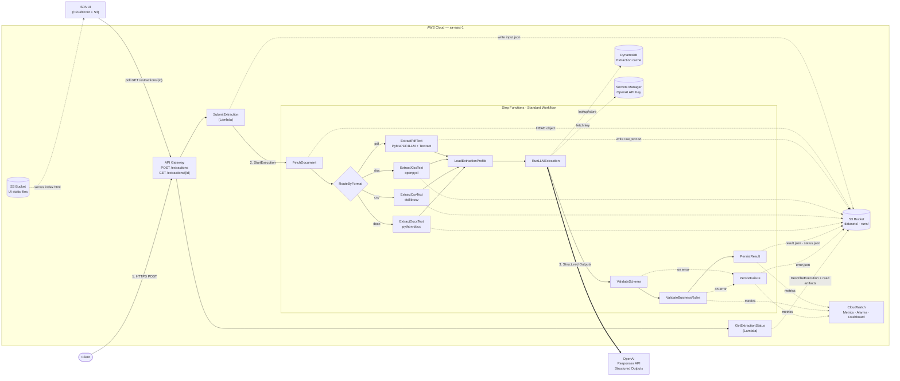

# Universal Extractor

[](https://www.python.org/downloads/)
[](https://aws.amazon.com/)
[](https://aws.amazon.com/serverless/sam/)
[](https://aws.amazon.com/step-functions/)
[](https://aws.amazon.com/lambda/)
[](https://openai.com/)
[](https://aws.amazon.com/cloudwatch/)

> A production-grade AWS serverless document extraction platform that converts PDF, XLSX, CSV, and DOCX payroll documents into validated, schema-bound JSON with OCR fallback, business-rule validation, confidence scoring, and operational observability.

## Table of Contents
- [Overview](#overview)
- [Features](#features)
- [Architecture](#architecture)
- [Technology Stack](#technology-stack)
- [Project Structure](#project-structure)
- [Getting Started](#getting-started)
- [Usage](#usage)
- [Supported Formats and Fixtures](#supported-formats-and-fixtures)
- [System Design](#system-design)
- [Observability](#observability)
- [Deployment](#deployment)
- [Roadmap](#roadmap)
- [License](#license)
- [Acknowledgments](#acknowledgments)

## Overview
**Universal Extractor** is a reusable extraction platform designed for robust document understanding on AWS. The current production-hardened implementation focuses on a single domain, **payroll extraction**, but the architecture is intentionally profile-driven so the same pipeline can later support additional document families with new schemas and prompts.

The project is built to demonstrate the level of engineering expected from an AI Engineer / AWS Specialist portfolio project:
- **Schema-constrained extraction** instead of free-form prompting
- **Versioned extraction profiles** instead of ad-hoc prompt edits
- **OCR fallback for scanned PDFs** instead of assuming text-layer documents
- **Business-rule validation** beyond JSON Schema validation
- **Confidence, caching, retry taxonomy, and cost tracking** around the model call
- **Cloud-native observability** with metrics, alarms, dashboard, and auditable run artifacts

### Key Capabilities
- **Multi-format ingestion**: PDF, XLSX, CSV, and DOCX all produce the same payroll JSON contract
- **Profile-based extraction**: `profiles/<id>/<version>.yml` defines system prompt, user template, schema, and validation rules
- **Scanned PDF support**: text-layer extraction, Textract OCR/table extraction, and optional Vision fallback
- **Deterministic validation flow**: JSON Schema validation followed by payroll business-rule checks
- **Async-by-default API**: `POST /extractions` starts the workflow, `GET /extractions/{request_id}` retrieves status and results
- **Production controls**: prompt safety boundaries, retryable/non-retryable LLM errors, chunking for long docs, confidence scoring, and DynamoDB cache deduplication

## Features
- **OpenAI Structured Outputs** with `strict=true` to keep the LLM bound to the exact schema
- **Versioned payroll profile** with normalization rules for dates, numbers, nullability, and line-item taxonomy
- **Step Functions orchestration** instead of a monolithic Lambda
- **Business-rule validation** for payroll consistency checks such as gross/net math and required semantic fields
- **Artifact-first persistence** in S3 with `input.json`, `raw_text.txt`, `llm_response.json`, `usage_metrics.json`, `llm_trace.json`, `result.json`, `status.json`, and `error.json`
- **CloudWatch metrics and alarms** for extraction failures, confidence drops, and business-rule pass rate
- **Evaluation harness** with fake fixtures and expected outputs across all supported formats
- **Static web UI** hosted on S3 + CloudFront for manual testing and demos
- **Jenkins deployment pipeline** for validate, build, deploy, fixture sync, and UI publish

## Architecture


## Technology Stack
| Component | Technology | Purpose |
|-----------|------------|---------|
| **API Layer** | API Gateway + Lambda | Submit extraction requests and query execution status |
| **Workflow Engine** | AWS Step Functions Standard | Orchestrate extraction, validation, and persistence |
| **Language Model** | OpenAI Responses API | Schema-constrained structured extraction |
| **OCR** | AWS Textract | OCR and table extraction for scanned or sparse PDFs |
| **Document Parsing** | PyMuPDF4LLM, openpyxl, csv, python-docx | Format-specific text normalization |
| **Validation** | JSON Schema + custom payroll rules | Structural and semantic correctness |
| **Storage** | Amazon S3 | Input documents, run artifacts, results, failures, UI assets |
| **Caching** | Amazon DynamoDB | Deduplicate equivalent LLM calls |
| **Secrets** | AWS Secrets Manager | Securely store the OpenAI API key |
| **Observability** | CloudWatch Metrics, Alarms, Dashboard | Operational monitoring and alerting |
| **Infrastructure as Code** | AWS SAM | Define and deploy all cloud resources |
| **CI/CD** | Jenkins | Validate, build, deploy, sync fixtures, publish UI |

## Project Structure
```bash
universal-extractor/
├── functions/
│   ├── submit_extraction/             # POST /extractions entrypoint
│   ├── get_extraction_status/         # GET /extractions/{request_id}
│   ├── fetch_document/                # Detects document metadata and format
│   ├── extract_pdf_text/              # Multi-strategy PDF extraction
│   ├── extract_xlsx_text/             # XLSX normalization
│   ├── extract_csv_text/              # CSV normalization
│   ├── extract_docx_text/             # DOCX normalization
│   ├── load_extraction_profile/       # Loads prompt/schema contract
│   ├── run_llm_extraction/            # OpenAI call, cache, cost, confidence, traces
│   ├── validate_schema/               # JSON Schema validation
│   ├── validate_business_rules/       # Payroll-specific semantic checks
│   ├── persist_result/                # Writes success artifacts and metrics
│   └── persist_failure/               # Writes failure artifacts and metrics
├── layers/common/python/app_common/   # Shared config, validators, usage, cache, observability
├── profiles/
│   ├── payroll/v1.yml                 # Production-ready payroll profile
│   └── cash_requirements/v1.yml       # Additional profile example
├── tests/fixtures/payroll/
│   ├── pdf/                           # Fake PDF payroll fixtures + expected outputs
│   ├── xlsx/                          # Fake XLSX payroll fixtures + expected outputs
│   ├── csv/                           # Fake CSV payroll fixtures + expected outputs
│   └── docx/                          # Fake DOCX payroll fixtures + expected outputs
├── scripts/
│   ├── extract_locally.py             # Local extraction without AWS
│   ├── evaluate_fixtures.py           # Offline and LLM-backed evaluation harness
│   ├── smoke_test_formats.py          # Cross-format smoke tests
│   └── generate_fake_*_payrolls.py    # Fixture generators
├── events/                            # Example API payloads for manual tests
├── ui/index.html                      # Static extraction UI
├── template.yml                       # AWS SAM infrastructure
├── Jenkinsfile                        # CI/CD pipeline definition
└── docs/production_readiness_checkpoints.md
```

## Getting Started
### Prerequisites
- **Python**: 3.13 or higher
- **AWS CLI credentials**: required only for AWS deployment and cloud tests
- **OpenAI API key**: required for local model-backed extraction or evaluation
- **AWS SAM CLI**: required for template validation and deployment workflows

### Installation
1. **Clone the repository**
```bash
git clone https://github.com/MaiconKevyn/aws-universal-extractor.git
cd aws-universal-extractor
```

2. **Create and activate a Python environment**
```bash
python3.13 -m venv .venv
source .venv/bin/activate
```

3. **Install dependencies**
```bash
pip install -r requirements.txt
pip install awscli aws-sam-cli
```

4. **Create a local `.env` file**
```env
OPENAI_API_KEY=sk-proj-your-key
OPENAI_MODEL=gpt-4.1-mini
```

### Local Validation
Validate the shared Python code:
```bash
python -m compileall functions layers/common/python/app_common scripts
```

Validate the SAM template:
```bash
sam validate --template-file template.yml --region sa-east-1
```

### Running a Local Extraction
Extract a payroll document locally without deploying the full AWS stack:
```bash
./.venv/bin/python scripts/extract_locally.py \
  --pdf tests/fixtures/payroll/pdf/paystub_001_canonical.pdf \
  --profile payroll \
  --version v1
```

### Running the Evaluation Harness
Offline mode validates fixture integrity and schema expectations:
```bash
./.venv/bin/python scripts/evaluate_fixtures.py --mode offline
```

LLM-backed sampling checks extraction accuracy against the ground truth:
```bash
./.venv/bin/python scripts/evaluate_fixtures.py \
  --mode llm \
  --sample-per-format 1 \
  --min-accuracy 0.95
```

### Running Smoke Tests
```bash
./.venv/bin/python scripts/smoke_test_formats.py
```

## Usage
### API Contract
The API payload is the same across all formats. The only thing that changes is the S3 object key and extension.

```json
{
  "document": {
    "bucket": "payroll-dev-<account>-sa-east-1",
    "key": "datasets/fixtures/payroll/pdf/paystub_001_canonical.pdf"
  },
  "extraction_profile": {
    "id": "payroll",
    "version": "v1"
  },
  "client_id": "demo-client",
  "document_id": "paystub_001",
  "idempotency_key": "demo-payroll-pdf-001",
  "metadata": {
    "source_system": "manual-test"
  }
}
```

### Example Request
```bash
curl -X POST "https://<api-id>.execute-api.<region>.amazonaws.com/<stage>/extractions" \
  -H "Content-Type: application/json" \
  -d @events/submit-extraction.json
```

Example accepted response:
```json
{
  "status": "accepted",
  "request_id": "req_5b51cc1e029b4c3bbd63538e",
  "execution_arn": "arn:aws:states:sa-east-1:123456789012:execution:document-extraction:req_5b51cc1e029b4c3bbd63538e",
  "output_prefix": "s3://payroll-dev-123456789012-sa-east-1/runs/payroll/v1/2026/04/25/req_5b51cc1e029b4c3bbd63538e/"
}
```

Poll for status and final result:
```bash
curl "https://<api-id>.execute-api.<region>.amazonaws.com/<stage>/extractions/<request_id>"
```

### Example Formats
- PDF: `events/submit-extraction.json`
- Scanned PDF: `events/submit-payroll-scanned-pdf-extraction.json`
- XLSX: `events/submit-payroll-xlsx-extraction.json`
- CSV: `events/submit-payroll-csv-extraction.json`
- DOCX: `events/submit-payroll-docx-extraction.json`

### Web UI
The stack also deploys a static web interface from [ui/index.html](ui/index.html). After deployment, open the CloudFormation output `UiUrl`, submit a bucket/key pair, and the UI will poll `GET /extractions/{request_id}` until the run finishes.

## Supported Formats and Fixtures
The production-ready profile currently targets **payroll extraction** with one shared schema across all formats.

| Format | Extraction Path | Fixture Directory |
|--------|------------------|------------------|
| **PDF** | PyMuPDF4LLM text layer, Textract OCR/table extraction, optional Vision fallback | `tests/fixtures/payroll/pdf/` |
| **XLSX** | openpyxl worksheet normalization | `tests/fixtures/payroll/xlsx/` |
| **CSV** | Python stdlib CSV normalization | `tests/fixtures/payroll/csv/` |
| **DOCX** | python-docx paragraph/table normalization | `tests/fixtures/payroll/docx/` |

Each fixture has a matching `.expected.json` file so format-level regressions are measurable.

Example fixture set:
- `paystub_001_canonical`
- `paystub_002_with_overtime`
- `paystub_003_with_bonus`
- `paystub_006_scanned` for OCR validation

## System Design
### Request Lifecycle
1. **SubmitExtraction** validates the request, creates `request_id`, persists `input.json`, and starts the Step Functions execution.
2. **FetchDocument** performs an S3 `HEAD`, derives format metadata, and chooses the extraction branch.
3. **Format-specific extraction** normalizes the source document into a common text representation.
4. **LoadExtractionProfile** reads the exact prompt/schema contract from `profiles/<id>/<version>.yml`.
5. **RunLLMExtraction** calls OpenAI Structured Outputs with retry rules, prompt safety boundaries, cache lookup, token/cost tracking, and optional chunking.
6. **ValidateSchema** enforces the JSON contract again on the returned object.
7. **ValidateBusinessRules** checks payroll invariants such as required semantic fields and gross/net consistency.
8. **PersistResult** or **PersistFailure** writes auditable artifacts to S3 and emits CloudWatch metrics.

### Run Artifact Layout
Each execution writes artifacts under:

```text
runs/<profile>/<version>/<YYYY>/<MM>/<DD>/<request_id>/
```

Typical contents:
- `input.json`
- `document_metadata.json`
- `raw_text.txt`
- `llm_response.json`
- `usage_metrics.json`
- `llm_trace.json`
- `result.json`
- `status.json`
- `error.json` on failure

### AI Engineering Controls
- **Prompt injection defense**: document text is treated as untrusted input and wrapped with explicit boundaries
- **Retry taxonomy**: 429, timeout, connection, and 5xx failures are retryable; auth and malformed request errors are not
- **Confidence scoring**: output completeness and evidence alignment are measured and persisted
- **Chunking for long documents**: bounded chunk/merge flow prevents uncontrolled prompt growth
- **Caching and deduplication**: same document + same profile + same model can reuse cached results via DynamoDB
- **Cost accounting**: token usage and estimated cost are stored for every run

## Observability
The stack provisions native operational visibility so the system can be discussed as a real service, not just a demo.

### Metrics
CloudWatch custom metrics in the `UniversalExtractor` namespace track:
- extraction success and failure rates
- LLM confidence score
- business-rules pass rate
- estimated cost per run
- payroll numeric distributions

### Alarms
The SAM template provisions SNS-backed alarms for:
- **Extraction failure rate spike**
- **Low confidence score**
- **Business-rules pass-rate drop**

### Dashboard
The stack outputs `ExtractionDashboardUrl`, which points to the CloudWatch dashboard summarizing the core operational KPIs.

### Trace and Audit Artifacts
Every run persists model-adjacent diagnostics:
- `llm_trace.json`
- `usage_metrics.json`
- `llm_response.json`
- `status.json`
- `error.json` on failures

This makes post-mortem analysis possible without relying exclusively on Lambda logs.

## Deployment
### AWS SAM
Local SAM commands:
```bash
sam validate --template-file template.yml --region sa-east-1
sam build --template-file template.yml
```

Cloud deployment:
```bash
sam deploy --template-file .aws-sam/build/template.yaml \
  --stack-name universal-extractor-dev \
  --region sa-east-1 \
  --capabilities CAPABILITY_IAM CAPABILITY_NAMED_IAM \
  --resolve-s3
```

### Jenkins
The repository includes a deployment pipeline in [Jenkinsfile](Jenkinsfile). The main stages are:
- `Checkout`
- `Preflight`
- `Prepare Python`
- `Resolve AWS Identity`
- `Validate`
- `Build`
- `Deploy`
- `Sync Payroll Fixtures`
- `Deploy UI`

Important stack outputs:
- `ExtractionApiUrl`
- `DocumentsBucketName`
- `PayrollFixturesPrefix`
- `ExtractionCacheTableName`
- `ExtractionDashboardUrl`
- `UiUrl`

## Roadmap
- Add more production-ready extraction profiles beyond payroll
- Introduce async Textract flows for very large PDFs
- Add authenticated multi-tenant API access
- Add manual review workflow for low-confidence or failed-validation runs
- Expand fixture coverage for noisier real-world document variations
- Export traces to external LLM observability platforms when needed

## License
This project is licensed under the MIT License. See [LICENSE](/home/maiconkevyn/PycharmProjects/universal-extractor/LICENSE) for the full text.